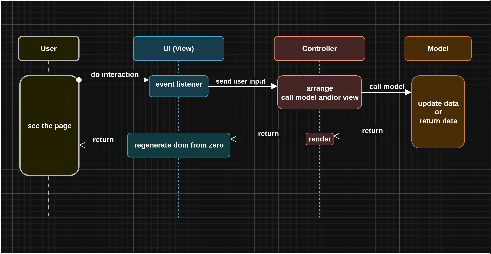

# Vanitodo

A Todolist created with only vanilla JS.

## Live App

[https://fath-nasrudin.github.io/vanitodo](https://fath-nasrudin.github.io/vanitodo)

## How The UI and The Data Sync?

For now, since the app is so tiny, the app just rerender the whole app from the root to the leaf when mutation happens.

## How I Organize the code?

I decide to use MVC approach for better maintainability and scability. I create Todo Model for dealing with logic and data, View for dealing with the user interface, and Controller to handle View request,
